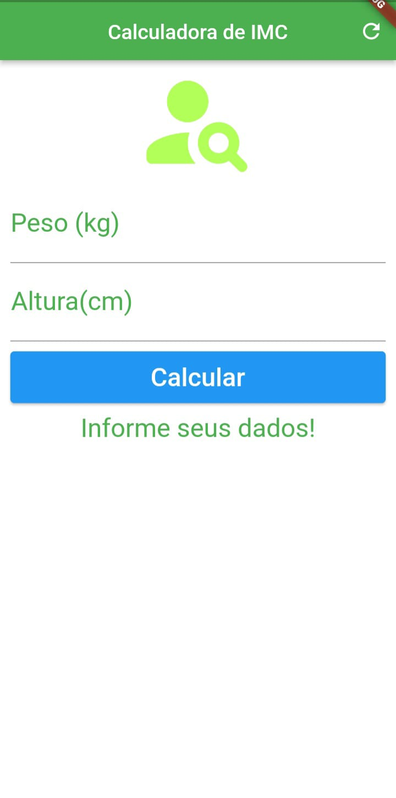

# imcflutter_dart
The application was built only in dart/flutter, it was not adapted for android or ios.
But it was built for android and ios

##SCREENSHOT

| Image |
|----------|
|  |
This is an application to calculate your body mass index, when calculated it will appear a sentence below the calculate, where it will say if you are with ideal weight, underweight, slightly overweight, obesity I, obesity II, obesity III

##LICENSE
MIT License

Copyright (c) 2023 Leticia Heloisa Bini Haiduk

Permission is hereby granted, free of charge, to any person obtaining a copy of this software and associated documentation files (the "Software"), to deal in the Software without restriction, including without limitation the rights
to use, copy, modify, merge, publish, distribute, sublicense, and/or sell copies of the Software, and to permit persons to whom the Software is
furnished to do so, subject to the following conditions:

The above copyright notice and this permission notice shall be included in all copies or substantial portions of the Software.

THE SOFTWARE IS PROVIDED "AS IS", WITHOUT WARRANTY OF ANY KIND, EXPRESS OR IMPLIED, INCLUDING BUT NOT LIMITED TO THE WARRANTIES OF MERCHANTABILITY,
FITNESS FOR A PARTICULAR PURPOSE AND NONINFRINGEMENT. IN NO EVENT SHALL THE AUTHORS OR COPYRIGHT HOLDERS BE LIABLE FOR ANY CLAIM, DAMAGES OR OTHER
LIABILITY, WHETHER IN AN ACTION OF CONTRACT, TORT OR OTHERWISE, ARISING FROM, OUT OF OR IN CONNECTION WITH THE SOFTWARE OR THE USE OR OTHER DEALINGS IN THE
SOFTWARE.

[For more information, see the full MIT License](https://opensource.org/licenses/MIT)
